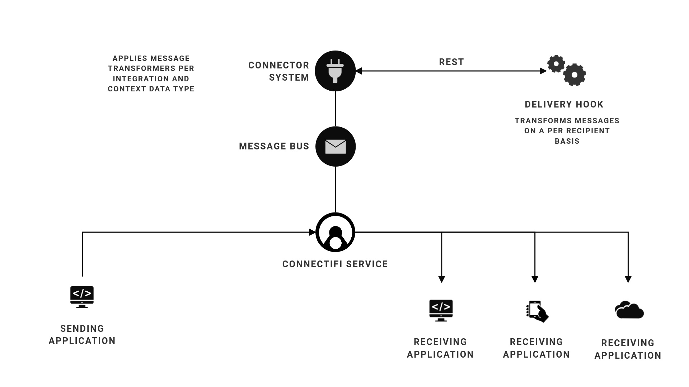
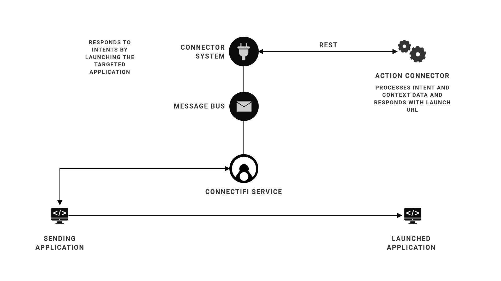
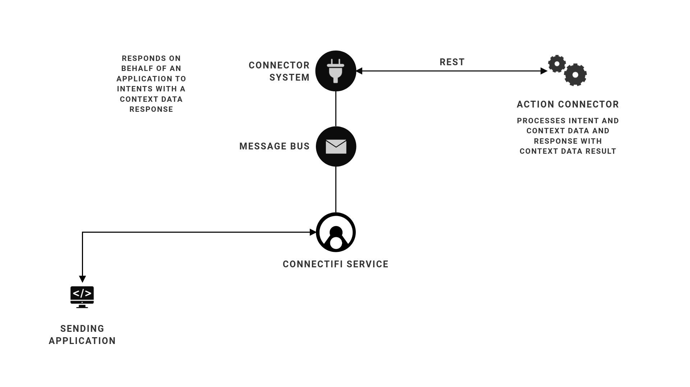

# Connectifi Connectors
Example Actions Connectors and Delivery Hooks for the Connectifi Integration Platform. Use this repo as a starting point and building blocks for implementing your own integrations with Connectifi.

## About Connectifi
Connectifi is a next generation integration platform that connects applications, services, and agents with deep user experience integration that works across any device and client technology.  Connectifi integrates full stack, with support for the FDC3 protocol for UI integration and REST integration with services and SaaS applications.

## Working with Context Data and Intents

Inspired by the Android and Apple intents systems, Connectifi uses Intents and Context metadata to describe functions and data interfaces and support reusable, plug and play integrations across APIs and apps.  Use the provided FDC3 and Connect name spaces and/or define your own.  

## Connector Types

There are two main types of connectors in this project:

- Delivery Hooks - which transform context data just before it is delivered to one or more destinations.
- Actions - which respond to an *intent* to return either a URL to launch or a data response.

### Delivery Hooks
Delivery Hooks act as transformers on the Connectifi message bus, acting whenever context data messages are delivered whether from a broadcast or an intent.  Delivery Hooks are assigned to act on specific context data types on a per/directory basis and they can modify context data selectively based on the recipient, this is extremely helpful for use cases such as mapping identifiers across multiple destinations and selectively redacting sensitive data.



### Launch Actions
Launch Actions allow an application to perform data transformations ahead of launching a specific destination or to define services that perform actions which result in the launch of a particular destination.  For example, launch actions can be used to lookup a SlackId from an email in order to generate the deep link to start a chat with the user.  Or, a launch action could be used to post a new contact into Hubspot and then launch the contact's Hubspot page directly.



### API Actions
API Actions allow an application to leverage REST services to return data for an intent.  The response data can then be used by the calling application without the need to launch another instance.  For example, from a it's UI, an application can raise the *GetPrice* intent and the end user can choose the source they want to get pricing data from.  On response, the application UI can be updated based on a standard context data format.  The raising application didn't have to build bespoke integrations into each data source and it can let the end user choose their source based on their own preference.



# Using this Project 

## What's inside

Connector implementations, written in Typescript, along with Serverless configurations for common cloud providers.  Currently supported providers are:
 - AWS
 - Azure (TBD)
 - Google (TBD)

## Getting Started

The first step is to install the dependencies for this repo:

```bash
npm install
```

Once you have the dependencies installed, the next thing to do is select your cloud provider.  You'll need to have your credentials all setup in order to deploy the API functions.  There is more info in the README files in each provider directory.

### Deployment

Deployment is standard serverless deployment.  There is more info in the README files in each provider directory.

## Directories

NPM workspaces project.  There are workspaces for all the cloud providers which contain serverless configs as well as some common etc folders.

- `workspaces/aws` where all the AWS serverless configuration lives
- `workspaces/common` common typescript functions, most of the code lives here
- `workspaces/common/actions` home for *Action* type connectors
- `workspaces/common/hooks` home for *Delivery Hook* type connectors

## Adding a Connector
Adding a new connector is easy.  Follow these steps for AWS:
- Put your business logic, according to connector type, into the `workspaces/common` directory
- Add an AWS entry point into `workspaces/aws`, using the `actions` or `hooks` folder, depending on your connector type
- Make an entry in `workspaces/aws/serverless.yml` to expose the endpoint for your connector and direct it to your entry point in `workspaces/aws`
- test, deploy, and call it from your Connectifi environment!

## Test Data

To make it easier to test connectors, there are some generic data utilities included in the project.  The can be used to generate input from an HTTP standpoint or generate specific provider events for executing functions directly.

Some examples of using the test utility are below.  The generator will simply output the JSON to standard out.  you can copy/paste from your terminal or pipe to files.

### aws lambda events

```bash
# generate AWS lambda event for a hook that processes fdc3.instrument context types
npm run data:aws fdc3.instrument AMZN

# generate AWS lambda event for a hook that processes fdc3.instrumentList context types
npm run data:aws fdc3.instrumentList AMZN,TSLA,BBG,MSFT

# generate AWS lambda event for a hook that processes fdc3.instrument context types
npm run data:aws fdc3.contact brian@connectifi.co

# generate AWS lambda event for a hook that processes fdc3.instrumentList context types
npm run data:aws fdc3.contactList brian@connectifi.co,nick@connectifi.co,kevin@connectifi.co
```

### http payloads

```bash
# generate an http post payload for a hook that processes fdc3.instrument context types
npm run data:aws fdc3.instrument AMZN

# generate an http post payload for a hook that processes fdc3.instrumentList context types
npm run data:http fdc3.instrumentList AMZN,TSLA,BBG

```

### Local testing
To run available tests locally run 

```bash
npm run test
```

If you want to enable integration testing of OpenAI connectors in your local environment set the following env variables:

```bash
export CFI_OPENAI_API_KEY=<your api key>
export CFI_OPENAI_INTEGRATION_TESTS=true # any value will work
```

This will run the tests in `workspaces/common/actions/api/openAI/tests/openai-integration-tests.spec.ts`. You can extend or use these tests as a template for your openAI actions


